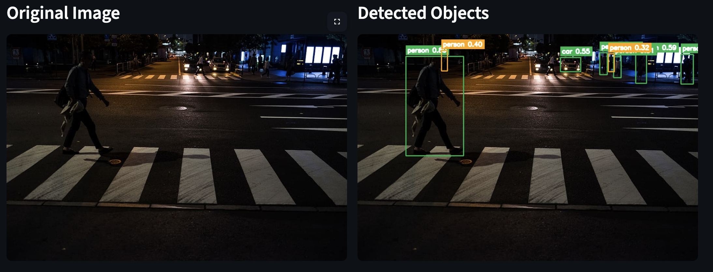
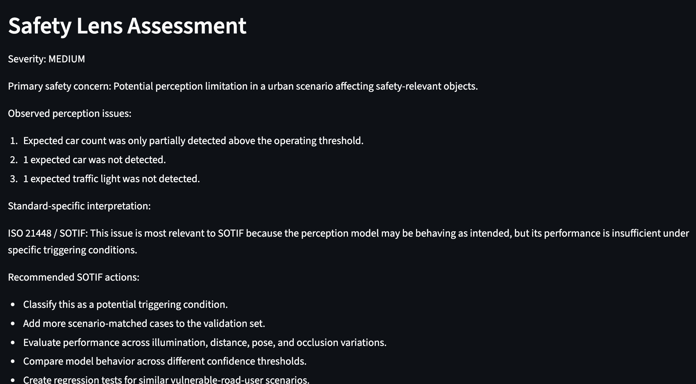
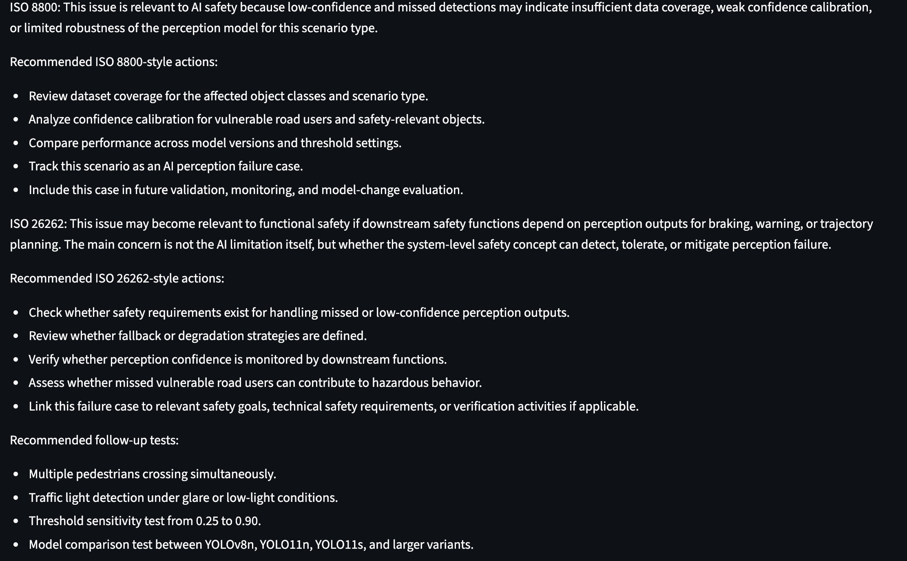
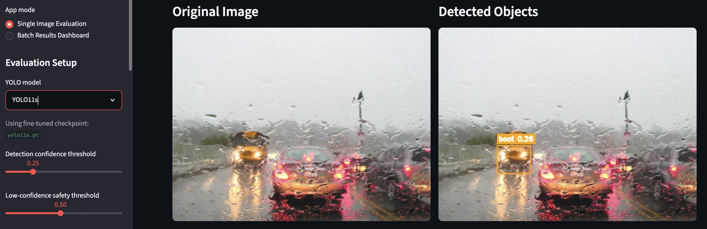
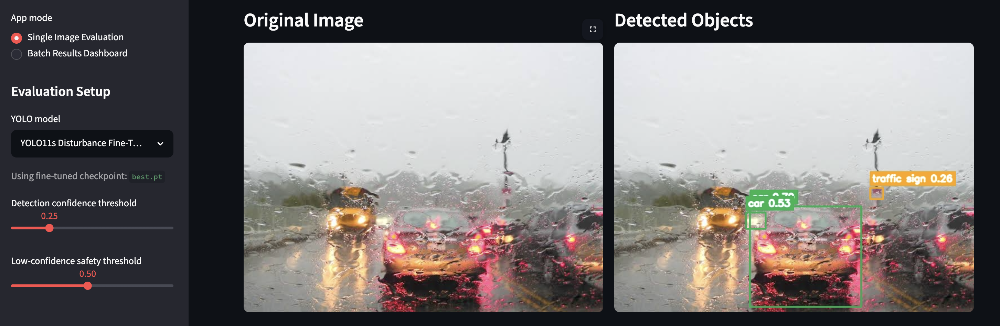
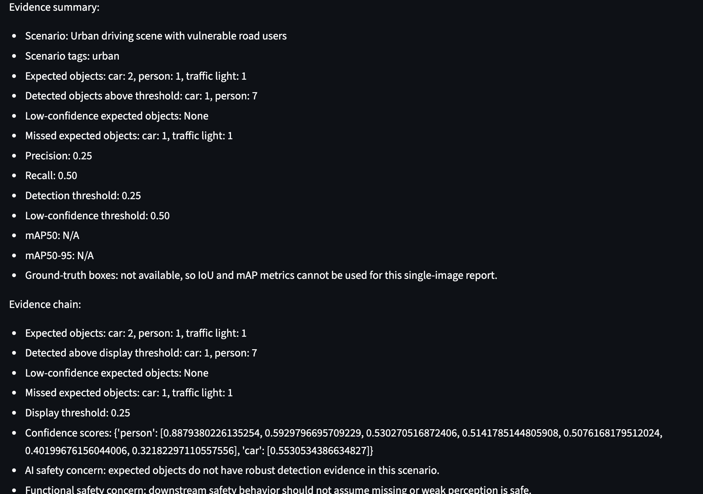
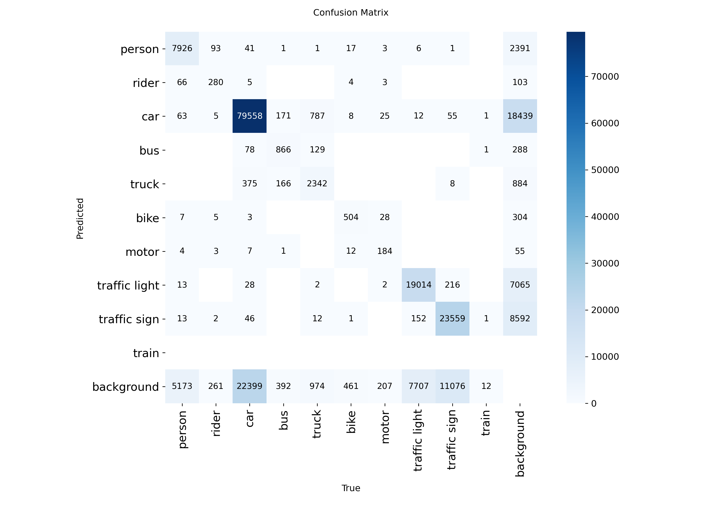
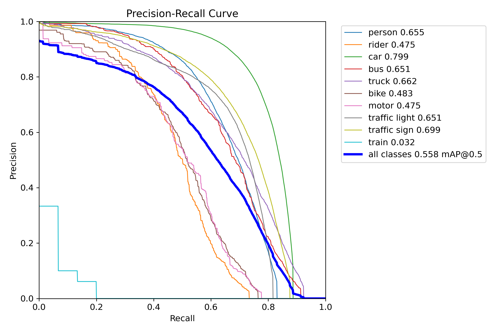
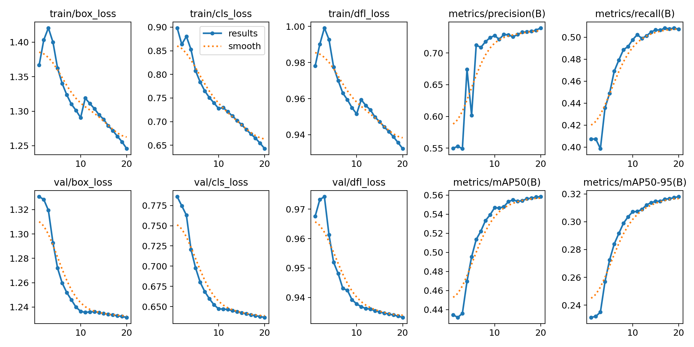

# Perception Safety Evaluation Copilot

Project 3 portfolio MVP: a computer-vision evaluation tool that connects perception AI results with safety engineering reasoning.

## Overview

Perception Safety Evaluation Copilot is designed to evaluate object-detection behavior in driving scenes and turn raw perception outputs into safety-relevant evidence. The tool combines YOLO-based detection, expected-object analysis, threshold sensitivity, perception failure reporting, and standards-aware Safety Lens reasoning aligned with ISO 21448 / SOTIF, ISO 26262, and ISO/PAS 8800.



This project complements:

- `Autonomous_Driving_Safety_Analyst` by bringing perception-model evidence into standards-aware safety analysis
- `Agentic_Document_AI_Platform_for_Safety_Engineering` by creating model evaluation artifacts that can later connect to requirements, traceability, and validation workflows

## Key Features

- YOLO-based object detection evaluation for driving images
- Safety Lens reporting for missed objects, low-confidence detections, and safety implications
- independent multi-retrieval for scenario similarity, failure mechanisms, and standard-specific guidance
- traceable Project 1 evidence supporting deterministic Safety Lens findings
- expected-object input for scenario-aware perception analysis
- threshold sensitivity and confidence-based risk interpretation
- standards-aware reasoning support for:
  - ISO 21448 / SOTIF
  - ISO 26262
  - ISO/PAS 8800
- adverse-condition analysis support for:
  - rain
  - fog
  - night
  - glare
  - occlusion
- disturbance-focused fine-tuning workflow using BDD100K YOLO-format data
- batch evaluation dashboard and local reporting workflow

## Safety Lens Architecture

```text
Deterministic evidence
  detections, misses, confidence, metrics, severity
                    |
                    v
Independent multi-retrieval
  scenario match | failure mechanism | SOTIF | ISO 8800 | ISO 26262
                    |
                    v
Human review
  confirm | reject | edit | trace findings to requirements and tests
```

Safety Lens is intentionally deterministic: measured detections, expected-object failures, thresholds, metrics, visibility, and robustness results drive its severity and recommendations. Project 1 retrieval supplies supporting standards and scenario evidence, but it does not override the measured result. Leave the scenario and expected-object fields blank unless the information is known from annotations or human review.

## Screenshots

### Detection Dashboard



Single-image evaluation showing the original scene, detected objects, and the live evaluation workflow.

### Safety Lens Assessment



Safety Lens v2 translates raw perception behavior into structured safety-oriented interpretation and recommended follow-up analysis.

### Model Comparison

The project keeps the earlier YOLO11s experiment as a comparison point. This is useful because it shows the evaluation path from a smaller model baseline to a stronger fine-tuned YOLO11m checkpoint.

Base `YOLO11s` before fine-tuning:



Fine-tuned `YOLO11s Disturbance Fine-Tuned` after BDD100K-based training:



The current Streamlit default is `YOLO11m BDD100K Stage 1 (Fine-Tuned)`, while YOLO11s remains available as an earlier comparison model when its local checkpoint exists.

### Failure Case Analysis



This view emphasizes the portfolio goal of Project 3: not just detecting objects, but explaining why missed or weak detections matter from a safety-engineering perspective.

## Evaluation Results

The app currently defaults to `YOLO11m BDD100K Stage 1 (Fine-Tuned)`, a YOLO11m checkpoint trained on a YOLO-formatted BDD100K driving-scene dataset. The local checkpoint used by Streamlit is:

```text
perception_training_outputs/yolo11m_bdd100k_stage1/weights/best.pt
```

Headline validation metrics from the latest 20-epoch Stage 1 run:

- Precision: `0.738`
- Recall: `0.508`
- mAP50: `0.558`
- mAP50-95: `0.318`
- Training output folder: `perception_training_outputs/yolo11m_bdd100k_stage1/`

The model selector also includes standard pretrained baselines such as `YOLOv8n`, `YOLOv8s`, `YOLO11n`, `YOLO11s`, `YOLO11m`, `YOLO11l`, and `YOLO11x`. Fine-tuned checkpoints only appear when their local `weights/best.pt` file exists in the expected project path.

### Fine-Tuned Model Comparison

| Model | Role | Precision | Recall | mAP50 | mAP50-95 |
| --- | --- | ---: | ---: | ---: | ---: |
| `YOLO11s Disturbance Fine-Tuned` | earlier lightweight fine-tuned model | `0.720` | `0.455` | `0.506` | `0.283` |
| `YOLO11m BDD100K Stage 1 (Fine-Tuned)` | current default model | `0.740` | `0.507` | `0.558` | `0.318` |

Interpretation: YOLO11m is the better current default because it improves both recall and mAP, while YOLO11s remains valuable as a smaller-model comparison and portfolio evidence of iterative model evaluation.

### Confusion Matrix



Engineering interpretation:

- strongest detection performance appears on vehicle and infrastructure classes such as cars, traffic lights, and traffic signs
- the dominant failure mode is missed detections rather than incorrect class assignment
- vulnerable road users remain the most safety-relevant weakness area

### Precision-Recall Curve



The trained model achieves reasonable precision but only moderate recall, which is especially important for safety review because missed objects generally matter more than ordinary class confusion.

### Training Curves



Training converged stably across 20 epochs, with decreasing box loss, classification loss, and DFL, and no strong sign of overfitting during the observed training window.

### Key Findings

- the model converged normally during fine-tuning
- the default operating threshold around `0.25` remains a practical starting point for review
- increasing confidence threshold improves precision but reduces recall quickly
- false negatives are the most important perception risk pattern
- pedestrians, riders, bicycles, and motorcycles remain the most safety-critical weak classes

Earlier YOLO11s fine-tuning notes are available in [docs/yolo11s_finetuning_summary.md](docs/yolo11s_finetuning_summary.md).

## Future Integration

### Project 1: Autonomous Driving Safety Analyst

- retrieve standards and scenario context through MCP
- connect Safety Lens findings to ISO 26262, ISO 21448 / SOTIF, and ISO/PAS 8800 guidance
- enrich scene interpretation with known scenario and exposure context

### Project 2: Agentic Document AI Platform for Safety Engineering

- link perception failures to safety requirements and traceability items
- connect evaluation outputs to generated test cases and project workspaces
- extend model evaluation evidence into workflow tracking, reporting, and governance

## Local Setup

From this folder:

```bash
cd Perception_Safety_Evaluation_Copilot
python -m venv .venv
source .venv/bin/activate
pip install --upgrade pip
pip install -r requirements.txt
```

Run the app:

```bash
streamlit run app.py
```

If `streamlit` is not found:

```bash
python -m streamlit run app.py
```

Run tests:

```bash
pytest
```

## YOLO Fine-Tuning Setup

Ready-to-use local training assets:

- dataset YAML: [training/bdd100k_yolo_local.yaml](training/bdd100k_yolo_local.yaml)
- training helper: [scripts/train_yolo_bdd100k.py](scripts/train_yolo_bdd100k.py)

Smoke test locally:

```bash
cd Perception_Safety_Evaluation_Copilot
source .venv/bin/activate
python scripts/train_yolo_bdd100k.py --model yolo11s.pt --epochs 1 --batch 8 --device mps --name smoke_yolo11s
```

Fine-tune `YOLO11s`:

```bash
python scripts/train_yolo_bdd100k.py --model yolo11s.pt --epochs 20 --batch 16 --device mps --name yolo11s_disturbance_ft
```

Fine-tune `YOLO11m` for the current Stage 1 model:

```bash
python scripts/train_yolo_bdd100k.py --model yolo11m.pt --epochs 20 --batch 16 --device 0 --name yolo11m_bdd100k_stage1
```

For Colab or Linux GPU, switch `--device` to `0`.

Training outputs are saved under:

```text
runs/bdd100k_training/
```

Colab training outputs can also be copied into:

```text
perception_training_outputs/<run_name>/
```

For the current default model, the app expects:

```text
perception_training_outputs/yolo11m_bdd100k_stage1/weights/best.pt
```

Only the deployment checkpoint `best.pt` is needed by the app. Intermediate `epoch*.pt` files are intentionally not required and are usually too large for a normal GitHub push.

The old raw BDD100K folder `archive (1)` is no longer required for this fine-tuning path unless you want to rebuild custom subsets from raw JSON metadata.

## Ground Truth Input Format

Ground truth is optional in the MVP. Enter one expected object class per line:

```text
person: 1
car: 2
traffic light: 1
```

Also accepted:

```text
person,1
car
```

If ground truth is provided, the app calculates count-based precision and recall. A later version can extend this to bounding-box labels and IoU-based matching.

## Project 1 and nuScenes Connection

The app has an optional Project 1 bridge:

- `Add Project 1 safety context` appends Project 1's `standards_pdfs/nuscenes_dataset_profile.md` to the generated safety report
- `Project 1 / nuScenes sample` can load camera key frames from a local nuScenes root and convert nuScenes annotations into expected object counts

Expected nuScenes root shape:

```text
Autonomous_Driving_Safety_Analyst/
  datasets/
    nuscenes/
      samples/
        CAM_FRONT/
          *.jpg
      v1.0-trainval/
        sample.json
        sample_data.json
        sample_annotation.json
        sensor.json
        calibrated_sensor.json
        scene.json
        instance.json
        category.json
```

In the app, set `nuScenes metadata root` to the `v1.0-trainval` folder and `nuScenes data root` to the parent folder that contains `samples/`.

If Project 1 only contains `v1.0-trainval`, then Project 3 can still use the metadata-derived Project 1 safety profile, but it cannot display camera images until the matching `samples/CAM_*` files are available.

If Google Drive space is limited, create a smaller subset locally:

```bash
python scripts/create_nuscenes_colab_subset.py \
  --metadata-root /path/to/nuscenes/v1.0-trainval \
  --data-root /path/to/nuscenes \
  --output-root ~/Desktop/nuscenes_subset \
  --channel CAM_FRONT \
  --limit 200
```

Then upload only that subset to Colab or Google Drive.

## Batch Evaluation Dashboard

After running the Colab notebook, place these files in `outputs/`:

```text
outputs/
  perception_yolo_results.csv
  perception_eval_summary.csv
  perception_failure_report.md
```

For model comparisons, prefer model-specific names:

```text
outputs/
  perception_yolo_results_yolov8n_conf0p25.csv
  perception_eval_summary_yolov8n_conf0p25.csv
  perception_failure_report_yolov8n_conf0p25.md
  perception_yolo_results_yolo11s_conf0p25.csv
  perception_eval_summary_yolo11s_conf0p25.csv
  perception_failure_report_yolo11s_conf0p25.md
```

Then run:

```bash
streamlit run app.py
```

and choose `Batch Results Dashboard` in the sidebar.
